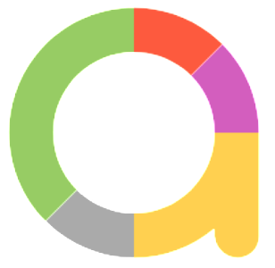
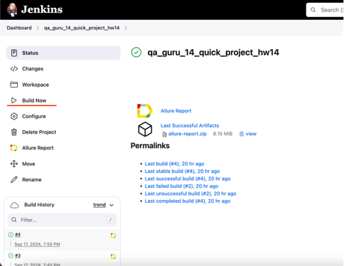
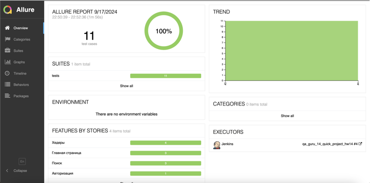
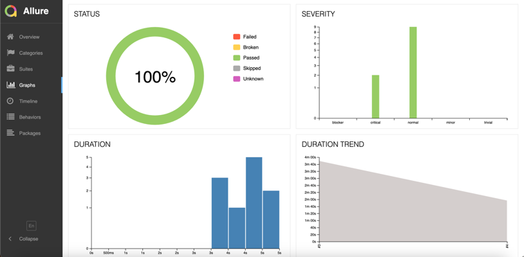
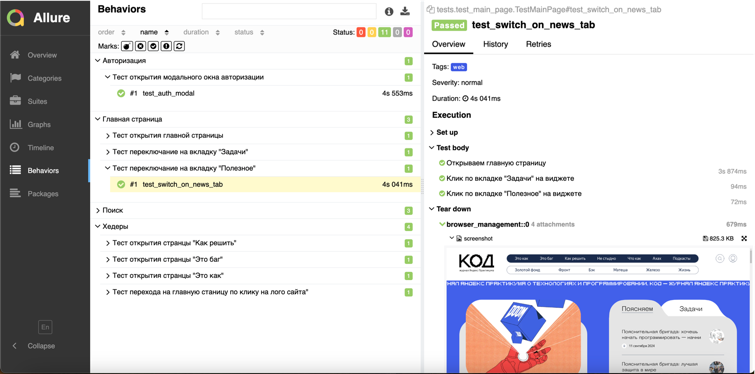
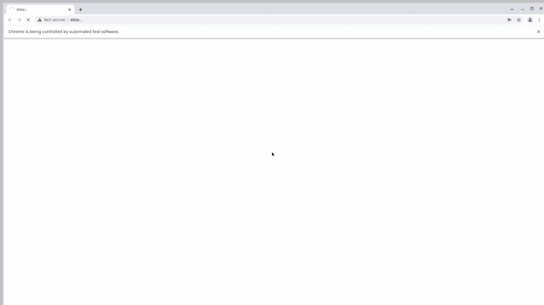
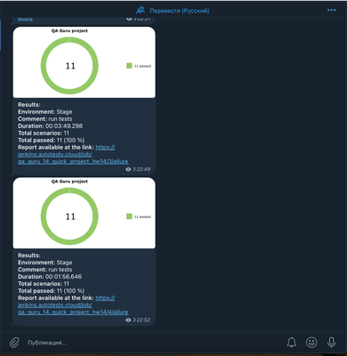

## Демо проект автоматизации тестирования сайта [The code](https://thecode.media/)

---
### Проект представляет собой набор UI-тестов покрывающих следующий функционал:
1. Авторизация
2. Работа функции поиска
3. Переключение контента на странице
4. Проверка корректного перехода между страницами

---
## Используемый стек:

Проект написан на языке программирования Python, с использованием фреймворков Pytest, Selene. 

Реализована удаленная сборка тестов в Jenkins 

Запуск тестов в Selenoid

После прохождения тестов система отправляет краткий отчет в [Telegram](https://t.me/demo_project_notifications) 

Так же в Jenkins будет доступен подробный отчет Allure

---
## Инструкция по запуску:
1. Перейти по ссылке в [сборку](https://jenkins.autotests.cloud/job/qa_guru_14_quick_project_hw14/)
2. Нажать Build Now

---
## Allure отчет о прохождении тестов
### Общий результат прохождения тестов

### Графики

### Подробный отчет о прохождении

### Видео прохождения теста

---
## Telegram отчет

